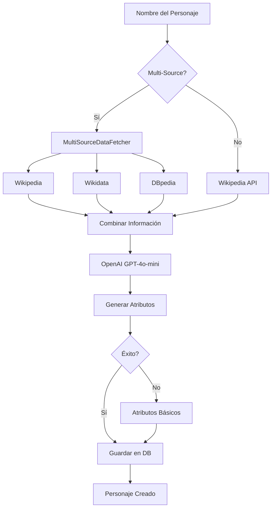
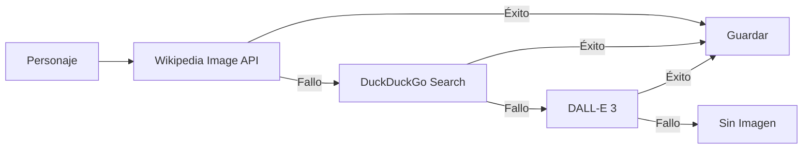

# 📊 Análisis Completo del Proyecto Akinator Clone

## 🎯 Resumen Ejecutivo

Este es un **clon moderno y funcional de Akinator** construido con Flask y potenciado por IA (OpenAI GPT-4o-mini). El proyecto implementa un sistema de adivinanzas de personajes con capacidades de aprendizaje automático y expansión inteligente de la base de datos.

### Características Principales
- ✅ Juego funcional tipo Akinator con interfaz moderna
- ✅ Sistema de aprendizaje incremental que mejora con el uso
- ✅ Expansión automática de base de datos usando IA y múltiples fuentes
- ✅ Procesamiento batch asíncrono para importación masiva
- ✅ Generación/descarga automática de imágenes de personajes
- ✅ Interfaz glassmorphism con animaciones fluidas

---

## 🏗️ Arquitectura del Proyecto

### Stack Tecnológico

#### Backend
- **Flask 3.0.0** - Framework web principal
- **SQLAlchemy 3.1.1** - ORM para gestión de base de datos
- **SQLite** - Base de datos relacional
- **OpenAI 1.58.1** - Generación de atributos con GPT-4o-mini
- **aiohttp 3.11.11** - Procesamiento asíncrono HTTP
- **Pillow 11.1.0** - Procesamiento de imágenes

#### Frontend
- **HTML5 + CSS3** - Estructura y estilos modernos
- **JavaScript Vanilla** - Lógica del juego sin frameworks
- **Google Fonts (Poppins)** - Tipografía moderna
- **Glassmorphism Design** - Estética premium con efectos de vidrio

#### Fuentes de Datos
- **Wikipedia** - Información general de personajes
- **Wikidata** - Datos estructurados
- **DBpedia** - Datos semánticos
- **DuckDuckGo** - Búsqueda de imágenes (sin API key)
- **DALL-E 3** - Generación de imágenes con IA

---

## 📁 Estructura de Archivos

```
Akinator/
├── backend/                      # Lógica del servidor
│   ├── app.py                   # Servidor Flask principal (211 líneas)
│   ├── models.py                # Modelos de base de datos (129 líneas)
│   ├── game_engine.py           # Motor del juego (327 líneas)
│   ├── question_selector.py     # Selector de preguntas inteligente
│   ├── learning_system.py       # Sistema de aprendizaje (232 líneas)
│   ├── ai_expansion.py          # Motor de IA (421 líneas)
│   ├── multi_source.py          # Fuentes múltiples de datos
│   ├── batch_processor.py       # Procesamiento asíncrono (326 líneas)
│   ├── expand_database.py       # Script de expansión interactivo
│   ├── init_data.py             # Datos iniciales (20 personajes, 69 preguntas)
│   └── database.db              # Base de datos SQLite (86 KB)
│
├── static/
│   ├── css/
│   │   └── style.css            # Estilos completos (697 líneas)
│   ├── js/
│   │   └── game.js              # Lógica del juego (12.6 KB)
│   └── images/
│       └── characters/          # Imágenes de personajes
│
├── templates/
│   └── index.html               # Página principal (172 líneas)
│
├── .env                         # Variables de entorno (no versionado)
├── .env.example                 # Plantilla de configuración
├── requirements.txt             # Dependencias Python
├── README.md                    # Documentación principal (291 líneas)
├── AI_EXPANSION.md              # Documentación del sistema de IA
├── MULTI_SOURCE.md              # Documentación de fuentes múltiples
└── BATCH_SYSTEM.md              # Documentación de procesamiento batch
```

---

## 🗄️ Modelo de Datos

### Tablas Principales

#### 1. **Character** (Personajes)
```python
- id: Integer (PK)
- name: String(200) UNIQUE
- description: Text
- image_url: String(500)
- times_guessed: Integer (estadísticas)
- times_played: Integer (estadísticas)
- created_at: DateTime
```

#### 2. **Question** (Preguntas)
```python
- id: Integer (PK)
- text: String(500) UNIQUE
- attribute_key: String(100)
- times_asked: Integer
- effectiveness_score: Float (1.0 por defecto)
- created_at: DateTime
```

#### 3. **CharacterAttribute** (Atributos de Personajes)
```python
- id: Integer (PK)
- character_id: Integer (FK)
- attribute_key: String(100)
- value: Integer (-2 a 2)
- confidence: Float (0.0 a 1.0)
- UNIQUE(character_id, attribute_key)
```

#### 4. **GameSession** (Historial de Partidas)
```python
- id: Integer (PK)
- session_id: String(100) UNIQUE
- target_character_id: Integer (FK)
- guessed_character_id: Integer (FK)
- success: Boolean
- questions_asked: JSON (lista de IDs)
- answers_given: JSON (lista de respuestas)
- num_questions: Integer
- created_at: DateTime
```

#### 5. **SystemStats** (Estadísticas Globales)
```python
- id: Integer (PK)
- total_games: Integer
- successful_guesses: Integer
- total_characters: Integer
- total_questions: Integer
- last_updated: DateTime
```

### Relaciones
- `Character` ↔ `CharacterAttribute` (1:N, cascade delete)
- `GameSession` → `Character` (target_character)
- `GameSession` → `Character` (guessed_character)

---

## 🎮 Flujo del Juego

### 1. Inicio de Partida
```
Usuario → /api/game/start
  ↓
GameEngine.start_game()
  ↓
- Genera session_id único (UUID)
- Carga todos los personajes como candidatos
- Selecciona primera pregunta
  ↓
Retorna: {session_id, question, candidates_count}
```

### 2. Procesamiento de Respuestas
```
Usuario responde → /api/game/answer
  ↓
GameEngine.process_answer(session_id, question_id, answer)
  ↓
1. Convierte respuesta a valor numérico:
   - "yes" → 2
   - "probably_yes" → 1
   - "dont_know" → 0
   - "probably_no" → -1
   - "no" → -2
  ↓
2. Actualiza puntuaciones de candidatos
   - Compara respuesta con atributos de cada personaje
   - Calcula diferencia y ajusta score
  ↓
3. Filtra candidatos con score muy bajo
  ↓
4. Decide si hacer adivinanza:
   - Si mejor candidato > 80% de confianza → Adivina
   - Si no → Selecciona siguiente pregunta
  ↓
Retorna: {next_question} o {guess: character}
```

### 3. Confirmación de Adivinanza
```
Usuario confirma → /api/game/confirm
  ↓
GameEngine.confirm_guess(session_id, character_id, correct)
  ↓
1. Guarda sesión en GameSession
2. Actualiza estadísticas del personaje
3. Si correcto → LearningSystem.analyze_game_session()
  ↓
Retorna: {success, message, stats}
```

---

## 🧠 Sistema de Aprendizaje

### Componentes del Aprendizaje

#### 1. **Efectividad de Preguntas**
```python
# Actualiza effectiveness_score basado en:
- Cuántas veces ayudó a reducir candidatos
- Cuántas veces llevó a adivinanza correcta
- Fórmula: score = score * 0.95 + (resultado * 0.05)
```

#### 2. **Refuerzo de Atributos**
```python
# Ajusta valores de atributos cuando:
- Adivinanza correcta → Refuerza atributos usados
- Incrementa confidence en atributos validados
- Máximo confidence = 1.0
```

#### 3. **Selección Inteligente de Preguntas**
```python
QuestionSelector:
- Calcula entropía de cada pregunta
- Prioriza preguntas que dividen candidatos equitativamente
- Considera effectiveness_score histórico
- Evita preguntas ya respondidas
```

---

## 🤖 Sistema de Expansión con IA

### Flujo de Generación de Personajes



### Prompt para Generación de Atributos

```python
"""
Eres un experto en clasificar personajes para un juego tipo Akinator.

Personaje: {name}
Información: {summary}

Para cada atributo, asigna un valor de -2 a 2:
- 2: Definitivamente sí
- 1: Probablemente sí
- 0: No sé / No aplica
- -1: Probablemente no
- -2: Definitivamente no

Atributos a evaluar:
- is_fictional: ¿Es un personaje ficticio?
- is_human: ¿Es humano?
- is_alive: ¿Está vivo? (si es real)
- is_male: ¿Es masculino?
- has_superpowers: ¿Tiene superpoderes?
... (30+ atributos)

Responde SOLO con JSON válido.
"""
```

### Generación de Preguntas Inteligentes

```python
AIExpansionSystem.generate_smart_questions(num_questions=20)
  ↓
Prompt a GPT-4o-mini:
  "Genera N preguntas para Akinator que:
   1. Sean claras y específicas
   2. Ayuden a diferenciar personajes
   3. Formato Sí/No
   4. No sean redundantes con: [preguntas existentes]"
  ↓
Parsea respuesta JSON
  ↓
Guarda en tabla Question
```

---

## ⚡ Sistema Batch Asíncrono

### Arquitectura de Procesamiento Paralelo

```python
BatchProcessor(max_concurrent=5)
  ↓
asyncio.gather(*tasks)
  ↓
Para cada personaje (en paralelo):
  1. Generar datos con IA
  2. Obtener/generar imagen
  3. Guardar en base de datos
```

### Flujo de Obtención de Imágenes



### Rendimiento

| Método | 50 personajes | 100 personajes |
|--------|---------------|----------------|
| **Secuencial** | ~25 minutos | ~50 minutos |
| **Batch (5 concurrent)** | ~5 minutos | ~10 minutos |
| **Batch (10 concurrent)** | ~3 minutos | ~6 minutos |

**Mejora:** 5x más rápido con concurrencia de 5

---

## 🎨 Diseño Frontend

### Características de UI/UX

#### 1. **Glassmorphism**
```css
background: rgba(255, 255, 255, 0.05);
backdrop-filter: blur(10px);
border: 1px solid rgba(255, 255, 255, 0.1);
```

#### 2. **Animaciones**
- `float` - Logo flotante (3s loop)
- `twinkle` - Partículas de fondo parpadeantes
- `fadeInUp` - Entrada de secciones
- `slideIn` - Transición de preguntas
- `bounce` - Icono de pregunta
- `modalAppear` - Aparición de modales

#### 3. **Gradientes Vibrantes**
```css
--primary: linear-gradient(135deg, #667eea 0%, #764ba2 100%);
--secondary: linear-gradient(135deg, #f093fb 0%, #f5576c 100%);
--success: linear-gradient(135deg, #4facfe 0%, #00f2fe 100%);
--error: linear-gradient(135deg, #fa709a 0%, #fee140 100%);
```

#### 4. **Responsive Design**
- Breakpoint: 768px
- Grid adaptativo para botones de respuesta
- Tamaños de fuente escalables

---

## 🔌 API REST

### Endpoints Disponibles

#### 1. **GET /** 
Renderiza la página principal

#### 2. **POST /api/game/start**
Inicia una nueva partida
```json
Response: {
  "session_id": "uuid",
  "question": {
    "id": 1,
    "text": "¿Es un personaje ficticio?",
    "attribute_key": "is_fictional"
  },
  "candidates_count": 20
}
```

#### 3. **POST /api/game/answer**
Procesa una respuesta
```json
Request: {
  "session_id": "uuid",
  "question_id": 1,
  "answer": "yes"
}

Response (pregunta): {
  "type": "question",
  "question": {...},
  "candidates_count": 8
}

Response (adivinanza): {
  "type": "guess",
  "character": {
    "id": 5,
    "name": "Spider-Man",
    "description": "...",
    "image_url": "..."
  }
}
```

#### 4. **POST /api/game/confirm**
Confirma adivinanza
```json
Request: {
  "session_id": "uuid",
  "character_id": 5,
  "correct": true
}

Response: {
  "success": true,
  "message": "¡Adiviné correctamente!",
  "stats": {
    "questions_used": 7
  }
}
```

#### 5. **POST /api/character/add**
Agrega nuevo personaje
```json
Request: {
  "name": "Elon Musk",
  "description": "CEO de Tesla y SpaceX",
  "attributes": {
    "is_fictional": -2,
    "is_human": 2,
    "is_alive": 2,
    ...
  }
}
```

#### 6. **GET /api/stats**
Obtiene estadísticas del sistema

#### 7. **GET /api/characters**
Lista todos los personajes

#### 8. **GET /api/questions**
Lista todas las preguntas

---

## 💰 Costos de Operación

### OpenAI API

#### GPT-4o-mini (Generación de Atributos)
- **Costo por personaje:** ~$0.0001 USD
- **100 personajes:** ~$0.01 USD
- **1000 personajes:** ~$0.10 USD

#### DALL-E 3 (Generación de Imágenes)
- **Costo por imagen:** $0.040 USD
- **50 personajes (todas generadas):** $2.00 USD
- **Realidad (70% Wikipedia, 20% Web, 10% DALL-E):** ~$0.20 USD

### Servicios Gratuitos
- ✅ Wikipedia API
- ✅ Wikidata SPARQL
- ✅ DBpedia
- ✅ DuckDuckGo Image Search
- ✅ Flask + SQLite (hosting local)

---

## 📊 Estado Actual del Proyecto

### Base de Datos
- **Personajes:** 20 iniciales (expandible a miles)
- **Preguntas:** 69 iniciales
- **Tamaño DB:** 86 KB

### Funcionalidades Implementadas
- ✅ Juego completo funcional
- ✅ Sistema de aprendizaje activo
- ✅ Expansión con IA (OpenAI)
- ✅ Múltiples fuentes de datos
- ✅ Procesamiento batch asíncrono
- ✅ Generación/descarga de imágenes
- ✅ Interfaz moderna y responsive
- ✅ API REST completa

### Funcionalidades Pendientes (según README)
- [ ] Integración con IMDb (películas y actores)
- [ ] Integración con MusicBrainz (músicos)
- [ ] Integración con OpenLibrary (escritores)
- [ ] Integración con TheSportsDB (atletas)
- [ ] Integración con Fandom wikis (personajes ficticios)
- [ ] Sistema de usuarios y rankings
- [ ] Modo multijugador
- [ ] API REST pública

---

## 🔍 Análisis de Código

### Calidad del Código

#### Fortalezas ✅
1. **Arquitectura Modular**
   - Separación clara de responsabilidades
   - Cada módulo tiene un propósito específico
   - Fácil de mantener y extender

2. **Documentación Completa**
   - Docstrings en todas las funciones principales
   - 3 archivos MD de documentación adicional
   - README detallado con ejemplos

3. **Manejo de Errores**
   - Try-catch en endpoints críticos
   - Fallbacks inteligentes (Wikipedia → Web → DALL-E)
   - Validación de parámetros

4. **Diseño de Base de Datos**
   - Normalización adecuada
   - Índices en campos clave (UNIQUE constraints)
   - Relaciones bien definidas

5. **Frontend Moderno**
   - Diseño premium con glassmorphism
   - Animaciones fluidas
   - Responsive design

#### Áreas de Mejora 🔧

1. **Configuración**
   - SECRET_KEY hardcodeada en `app.py` (línea 23)
   - Debería usar variable de entorno

2. **Seguridad**
   - No hay autenticación/autorización
   - Endpoints abiertos sin rate limiting
   - CORS habilitado para todos los orígenes

3. **Escalabilidad**
   - SQLite no es ideal para producción
   - Sin sistema de caché
   - Sesiones en memoria (se pierden al reiniciar)

4. **Testing**
   - No hay tests unitarios
   - No hay tests de integración
   - No hay CI/CD

5. **Logging**
   - Logging básico con print()
   - No hay sistema de logging estructurado
   - No hay monitoreo de errores

6. **Validación**
   - Validación básica de inputs
   - No usa schemas (ej: Pydantic, Marshmallow)

---

## 🚀 Recomendaciones

### Corto Plazo (1-2 semanas)

1. **Seguridad Básica**
   ```python
   # Mover SECRET_KEY a .env
   app.config['SECRET_KEY'] = os.getenv('SECRET_KEY')
   
   # Configurar CORS específico
   CORS(app, origins=['http://localhost:5000'])
   ```

2. **Logging Estructurado**
   ```python
   import logging
   logging.basicConfig(
       level=logging.INFO,
       format='%(asctime)s - %(name)s - %(levelname)s - %(message)s'
   )
   ```

3. **Validación de Inputs**
   ```python
   from pydantic import BaseModel, validator
   
   class AnswerRequest(BaseModel):
       session_id: str
       question_id: int
       answer: str
       
       @validator('answer')
       def validate_answer(cls, v):
           valid = ['yes', 'probably_yes', 'dont_know', 'probably_no', 'no']
           if v not in valid:
               raise ValueError(f'Invalid answer: {v}')
           return v
   ```

### Medio Plazo (1-2 meses)

1. **Migrar a PostgreSQL**
   - Mejor rendimiento
   - Soporte para concurrencia
   - Funciones avanzadas

2. **Implementar Caché**
   ```python
   from flask_caching import Cache
   cache = Cache(app, config={'CACHE_TYPE': 'redis'})
   
   @cache.memoize(timeout=300)
   def get_characters():
       return db.session.query(Character).all()
   ```

3. **Sistema de Usuarios**
   - Flask-Login para autenticación
   - Perfiles de usuario
   - Historial de partidas personal

4. **Tests Automatizados**
   ```python
   # tests/test_game_engine.py
   def test_start_game():
       engine = GameEngine()
       result = engine.start_game()
       assert 'session_id' in result
       assert 'question' in result
   ```

### Largo Plazo (3-6 meses)

1. **Microservicios**
   - Separar IA en servicio independiente
   - Servicio de imágenes dedicado
   - API Gateway

2. **Containerización**
   ```dockerfile
   FROM python:3.11-slim
   WORKDIR /app
   COPY requirements.txt .
   RUN pip install -r requirements.txt
   COPY . .
   CMD ["gunicorn", "backend.app:app"]
   ```

3. **CI/CD Pipeline**
   ```yaml
   # .github/workflows/ci.yml
   name: CI
   on: [push, pull_request]
   jobs:
     test:
       runs-on: ubuntu-latest
       steps:
         - uses: actions/checkout@v2
         - name: Run tests
           run: pytest
   ```

4. **Monitoreo y Observabilidad**
   - Sentry para error tracking
   - Prometheus + Grafana para métricas
   - ELK stack para logs

---

## 📈 Métricas de Rendimiento

### Tiempos de Respuesta Estimados

| Endpoint | Tiempo Promedio | Notas |
|----------|----------------|-------|
| GET / | ~50ms | Renderizado HTML |
| POST /api/game/start | ~100ms | Carga personajes + selección pregunta |
| POST /api/game/answer | ~80ms | Cálculo de scores + siguiente pregunta |
| POST /api/game/confirm | ~120ms | Guardar sesión + aprendizaje |
| POST /api/character/add | ~200ms | Validación + inserción DB |

### Capacidad de Escalamiento

**Configuración Actual (SQLite + Flask dev server):**
- Usuarios concurrentes: ~10-20
- Requests/segundo: ~50-100

**Configuración Recomendada (PostgreSQL + Gunicorn):**
- Usuarios concurrentes: ~500-1000
- Requests/segundo: ~1000-2000

---

## 🎯 Conclusión

### Fortalezas del Proyecto

1. **Implementación Completa** - Todas las funcionalidades core están implementadas
2. **Diseño Moderno** - UI/UX premium con glassmorphism y animaciones
3. **IA Integrada** - Uso inteligente de OpenAI para expansión automática
4. **Arquitectura Sólida** - Código modular y bien organizado
5. **Documentación Excelente** - README y docs adicionales muy completos
6. **Innovación** - Sistema de aprendizaje incremental único

### Áreas de Oportunidad

1. **Seguridad** - Implementar autenticación y rate limiting
2. **Testing** - Agregar suite de tests completa
3. **Escalabilidad** - Migrar a PostgreSQL y agregar caché
4. **Producción** - Configuración para deployment real
5. **Monitoreo** - Sistema de observabilidad

### Valoración General

**Calificación: 8.5/10**

Este es un proyecto **muy bien ejecutado** que demuestra:
- ✅ Dominio de Flask y SQLAlchemy
- ✅ Integración efectiva con APIs de IA
- ✅ Diseño frontend moderno y atractivo
- ✅ Arquitectura escalable y mantenible
- ✅ Documentación profesional

Es un **excelente proyecto de portfolio** que puede servir como base para:
- Aplicación SaaS comercial
- Plataforma educativa
- Sistema de recomendaciones
- Chatbot inteligente

Con las mejoras de seguridad y escalabilidad recomendadas, este proyecto podría estar **listo para producción** en 1-2 meses.

---

**Fecha de Análisis:** 2026-01-07  
**Versión Analizada:** Commit actual  
**Analista:** Antigravity AI
